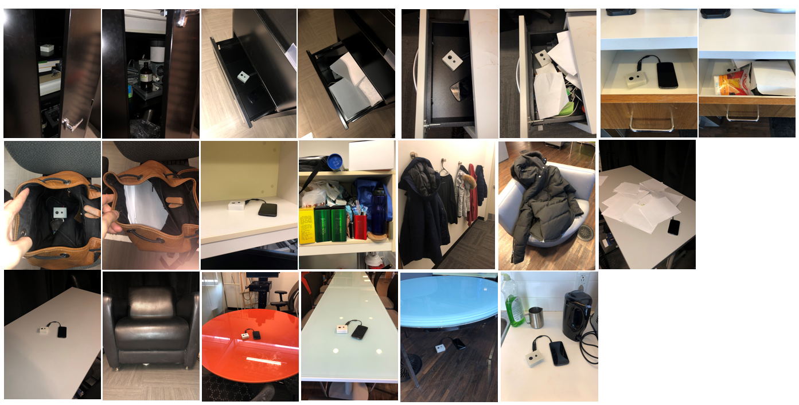
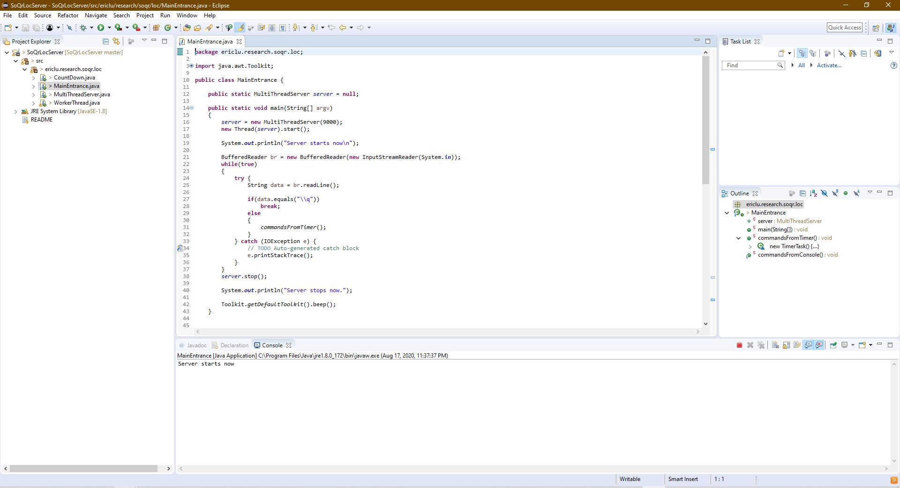
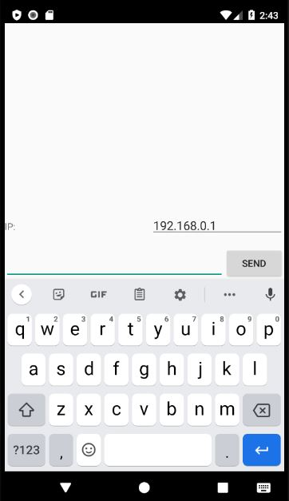

# Detecting-Open-or-Closed-Space-with-Acoustic-Sensing

  

The purpose of this project is to explore the technical feasilities of detecting open/closed space in the indoor environment with acoustic sensing. For the evaluation, We identifed 21 spaces, commonly seen in office or household environments. The first 14 spaces shown in the image are closed space, while the last 7 spaces count as open space. Please note that some of closed space are slights opened to demonstrate the sensor placement. We then placed a self-made prototype in each space. The prototype is capable of emitting and receiving acoustic waves. Since open and closed spaces would produce different reflections of waves, we can train a machine classifier to learn the differences and differentiate the two spaces. The results of this project could inform future design of an <b>indoor item-finding system for lost objects</b>. 

**Hardware Setup - An Android device with an amplified receiver**

  

The prototype is made of: (1) speaker (2) microphone (3) android device (4) amplification circuit (5) 9V battery used to power the <a href="http://afrotechmods.com/tutorials/2017/01/17/how-to-make-a-simple-1-watt-audio-amplifier-lm386-based/">amplification circuit</a>.
The android device is essentially being used as programmable micro-controller. We added an extenal speaker-microphone module to the device for two primary reasons: (1) To amplify the acoustic signal. (2) To place the microphone and the speaker on the same side so the body of the phone won't impede the propagation of sound waves. 

**SoQrLocServer - The Java server** 

  

The SoQrLocServer is a Java server that runs on PC. The serve is responsbile for processing all the audio files sent from multiple Andorid devices. It can be opened in Eclipse. Once open, click on the "Run" button the IDE and wait for the server to be ready. 

**SoLrSpacePropertyDetection - The TCP client responsbile for operating the android device**

  

SoLrSpacePropertyDetection is the TCP (Transmission Control Protocol) client that runs on the Android device. It's responsible for collecting and sending the acoustic data throught the WLAN to the Javs server. To run the client, install the client app on a smartphone through Android Studio and connect the smartphone to the WLAN. To connect to the Java server hosted on PC, type in the IPv4 Address and press "Send". 

**Data Collection**
In order to account for environmental factors, such as temperature, humidity and noise, we placed the sensor unit to collect data in each type of environment at three different time intervals of a day: 8:00am~11:00am, 11:00am~2:00pm and 2:00pm~6:00pm.  For each type environment at each time interval, we had the sensor unit probe 100 times, which summed up to a total of 23x3x100 = 6900 times. All the data were then fed into a multilayered perceptron for classification. 

**AcousticFeaturesExtraction** 

This module runs a multilayered perception on all the collected acoustic data. It classies the acoustic data into two distinct categories: closed and open. 

**Results""
